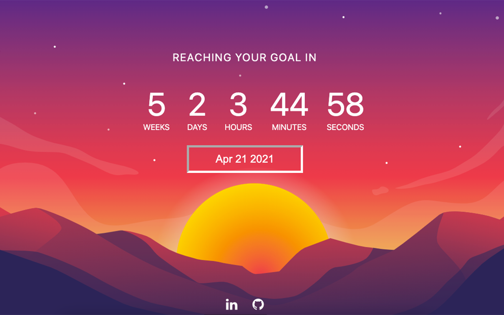

# Awaiter
  
 

A chrome extension setting up a long-term countdown.

Ever waited for something and calculated how much time it'll take you to be at this moment? 
Awaiter is a chrome extension that aims to help you with that and provide you a permanent counter about how much time's left until your goal!

[Download here](https://chrome.google.com/webstore/detail/awaiter/ckhlopfocebddgfgimahcjfnicihipaf/related?hl=fr)

 

